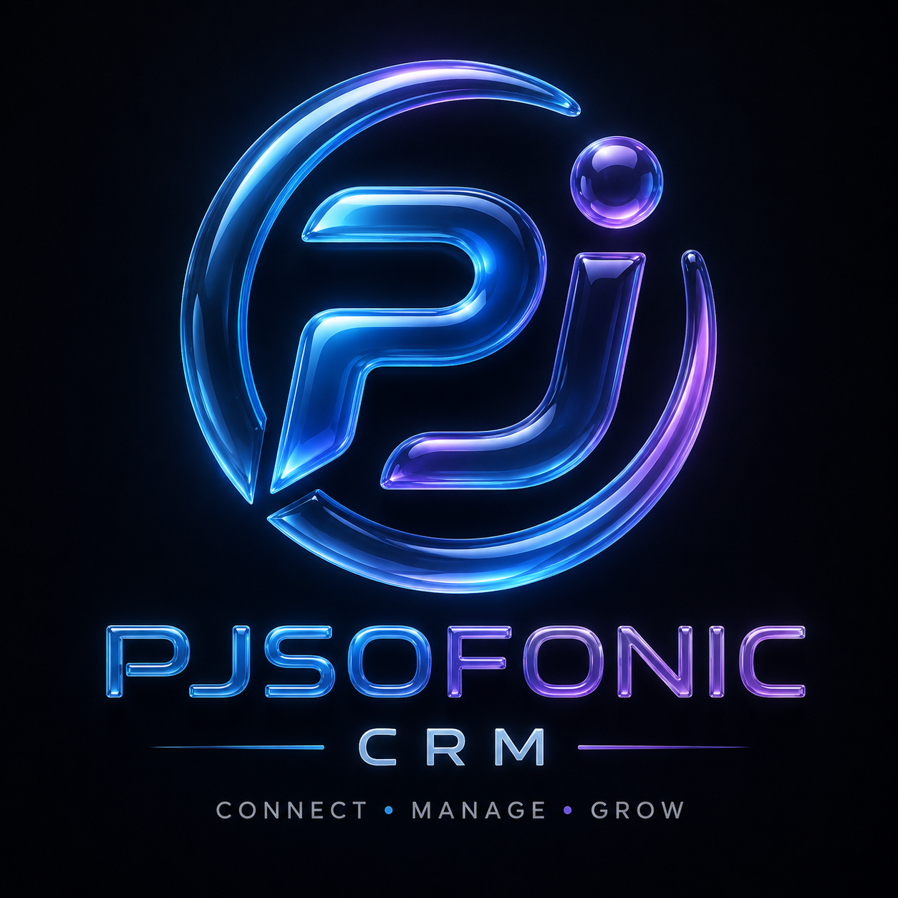

# PJSOFONIC CRM — Enterprise Client & Project Management Portal

<div align="center">
  
  <h3>Modern, Glassmorphic Frontend Built with React, Vite, and TailwindCSS</h3>
  <p><strong>Integrated with PJSOFONIC EMS SSO & Supabase (project_crm schema)</strong></p>
</div>

---

## ✨ Key Features

- 🔐 **EMS Identity Provider Single Sign-On**: Direct authentication against PJSOFONIC EMS (`https://erp-backend-1-02lc.onrender.com/api/auth/login`).
- 👥 **Role-Based Access Control**:
  - **ADMIN Portal**: Manage all project requests, approve milestones, publish progress updates, track client meetings, and review analytics.
  - **CUSTOMER Portal**: Submit project proposals, track progress in real-time, access asset vault, and approve final deliverables.
- 🔄 **Persistent Project Submissions & Tracking**:
  - All project requests remain permanently visible in both Customer and Admin workspaces through every phase (`NEW`, `APPROVED`, `PLANNING`, `IN_DEVELOPMENT`, `FINAL_APPROVAL`, `COMPLETED`).
- 📦 **Final Deliverables & Customer Approval Post**:
  - Admins submit Live URLs, GitHub Source Code, Bug QA Sheets, and Documentation links.
  - Customers review and approve final deliveries directly within the portal.
- 🗄️ **Supabase `project_crm` Schema Integration**: Direct client connectivity to isolated `project_crm` schema in Supabase.
- 📊 **Real-Time Dashboards & Analytics**: Financial KPIs, Sales Funnel, and Project Health tracking.

---

## 🏗️ Tech Stack

| Layer | Technologies |
| :--- | :--- |
| **Framework** | React 18, Vite |
| **Styling** | TailwindCSS, Glassmorphism UI Components |
| **Icons & UI** | Lucide React, Framer Motion |
| **Database SDK** | Supabase JS Client (`@supabase/supabase-js`) |
| **State & Auth** | React Context (`AuthContext`), LocalStorage Session Storage |

---

## 📁 Project Structure

```
PJSOFONIC-CRM/
├── public/                  # Static Assets & Logo
├── src/
│   ├── components/
│   │   ├── auth/            # LoginPage with EMS Authentication
│   │   ├── dashboard/       # AdminDashboard & CustomerDashboard
│   │   ├── leads/           # Sales Leads & Commercial Proposals
│   │   ├── milestones/      # Project Milestones & Progress Updates
│   │   ├── projects/        # Project Requests & Workspaces
│   │   └── common/          # Sidebar, Navbar, Alerts & Modals
│   ├── context/             # AuthContext (EMS SSO User State)
│   ├── services/
│   │   ├── api.js           # Centralized Backend API Client
│   │   └── supabase.js      # Supabase Client (project_crm schema)
│   ├── App.jsx              # Main Router & View State Controller
│   └── main.jsx             # React Application Entrypoint
├── render.yaml              # Render.com Static Site Blueprint
└── vite.config.js           # Vite Server & Backend Proxy Configuration
```

---

## 🛠️ Local Development Setup

```bash
# 1. Clone repository
git clone https://github.com/mrCoderPj04/PJSOFONIC-CRM.git
cd PJSOFONIC-CRM

# 2. Install dependencies
npm install

# 3. Start development server
npm run dev
```

Application will run locally at `http://localhost:5173`.

---

## ☁️ Render.com Deployment Guide

### Option 1: Automatic Blueprint (Recommended)
1. In [Render Dashboard](https://dashboard.render.com/), click **New +** → **Blueprint**.
2. Select repository: `mrCoderPj04/PJSOFONIC-CRM`.
3. Render automatically sets build command (`npm run build`), publish directory (`dist`), and rewrite rules.

### Option 2: Manual Static Site Setup
1. Click **New +** → **Static Site**.
2. Select repository `mrCoderPj04/PJSOFONIC-CRM`.
3. Configure settings:
   - **Build Command**: `npm run build`
   - **Publish Directory**: `dist`
4. Set Environment Variables:
   - `VITE_API_BASE_URL` = `https://pjsofonic-crm-backend.onrender.com/api/v1`
   - `VITE_SUPABASE_URL` = `https://ffauweryjzpnskdaqcyp.supabase.co`
   - `VITE_SUPABASE_PUBLISHABLE_KEY` = `sb_publishable_bLkboY3aqcA-LRqg7VROgw_IjxTh84f`
5. Add Rewrite Rule:
   - Source: `/*`
   - Destination: `/index.html`

---

## 🔗 Repository Information

- **Frontend Repository**: [https://github.com/mrCoderPj04/PJSOFONIC-CRM](https://github.com/mrCoderPj04/PJSOFONIC-CRM)
- **Backend Repository**: [https://github.com/mrCoderPj04/PJSofonic_CRM-Backend](https://github.com/mrCoderPj04/PJSofonic_CRM-Backend)
